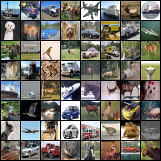
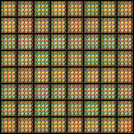

# SAGAN-PyTorch
A [PyTorch](https://pytorch.org/) implementation for Goodfellow et al.'s ICML 2019 work "Self-Attention Generative Adversarial Networks". [[arXiv]](https://arxiv.org/abs/1805.08318) [[PMLR]](http://proceedings.mlr.press/v97/zhang19d/zhang19d.pdf)


## Requirements

Please install requirements by `pip install -r requirements.txt`

- Python 3.7
- numpy 1.17.2
- torch 1.7.1
- torchvision 0.8.2
- Pillow 6.1.0

The following libraries are optional:

- tensorboard
- tqdm

## Usage

### Clone

```bash
git clone https://github.com/hiyouga/SAGAN-PyTorch.git
cd SAGAN-PyTorch
```

### Train

```bash
python main.py --batch_size 64 --imsize 32 --dataset cifar10 --adv_loss wgan-gp
```

## Results

Note that the wgan-gp loss is adopted by default, since we found that the wgan-gp loss performs much better than hinge loss in our experiments.

We use the CIFAR dataset as the unsupervised training set to generate images.



### Generated images with wgan-gp loss


### Generated images with hinge loss



<details>
<summary>Click to show the training details (visualized via [TensorBoard](https://www.tensorflow.org/tensorboard/))</summary>

### Attention weight and Inception score with wgan-gp loss


### Attention weight and Inception score with hinge loss


### Loss curves with wgan-gp loss


### Loss curves with hinge loss


</details>


## References

For SAGAN architecture:

1. Zhang et al. Self-Attention Generative Adversarial Networks. ICML. 2019.
1. https://github.com/heykeetae/Self-Attention-GAN
1. https://github.com/christiancosgrove/pytorch-spectral-normalization-gan

For inception score:

1. Salimans et al. Improved Techniques for Training GANs. NeurIPS. 2016.
1. Shane Barratt and Rishi Sharma. A Note on the Inception Score. ICML Workshop on Theoretical Foundations and Applications of Deep Generative Models. 2018.
1. https://github.com/sbarratt/inception-score-pytorch
1. https://github.com/w86763777/pytorch-gan-metrics

## License

MIT
